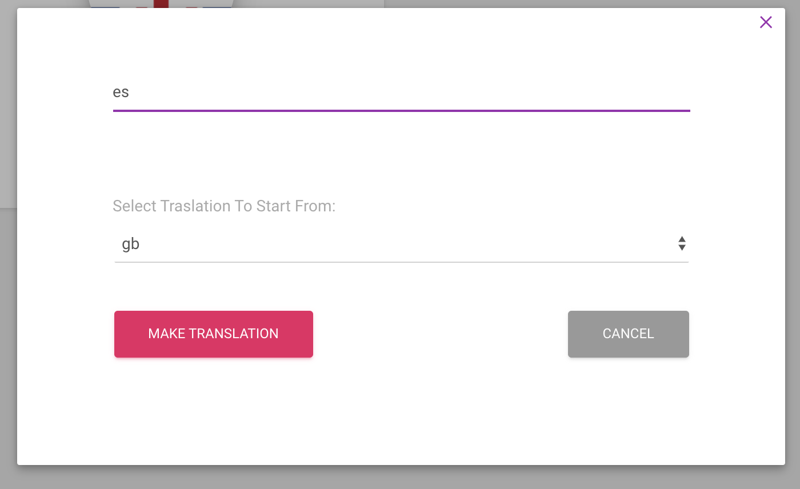
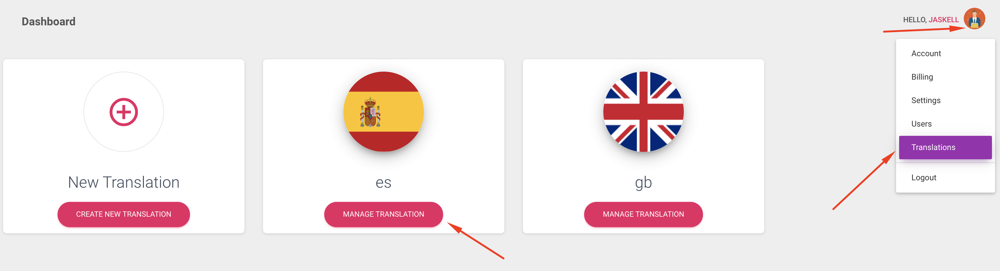

# Translate my app builder site

First you will need to have you builder page active. Login with your admin username and password.   
Click on your account image, and then on Translations. You will something like this.

If you want to add new translation, click on the **Create New Translation** button and enter the short-code for that language. Ex. fr, es, it ...

  
Then you can manage the translation.  

