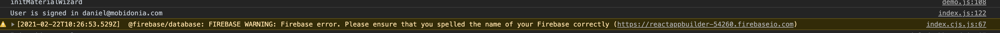

# Can't log in, stays on the login screen

#### **Possible problem \#1**

On the login screen, you get this warning

`FIREBASE WARNING: Firebase error. Please ensure that you spelled the name of your Firebase correctly`

#### **Cause \#1**

Firebase recently changed the structure for the domain for new databases. Thus, changing the previous location of the database from 

https://project\_id.firebaseio.com to https://project\_id**-default-rtdb**.firebaseio.com and that is why, the login works, but the use of the real-time database returns not found. 

#### Solution \#1

We have released fixed code on CodeCanyon, and also published the changes on our GitLab Repository. 

The only changes are in the file Builder/src/config/firebase\_config.js

In the environment preferences in netlfy you need to add

`REACT_APP_databasePrefix`**`-default-rtdb`**

\*\*\*\*

**Possible** **Problem \#2**

After you have entered your email/pass, you are not redirected to the admin backend.In the [console](https://mobidonia.support-hub.io/articles/how-to-open-the-developer-console), you receive this if you try to register a new user.

**Cause \#2**

Your Firebase Database permissions are not correctly set up.

**Solution \#2**

Change your Real-time Database rules

Suggested permissions are described in step **Create a real-time database**

