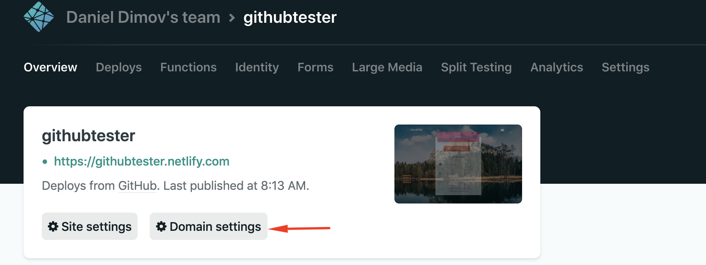
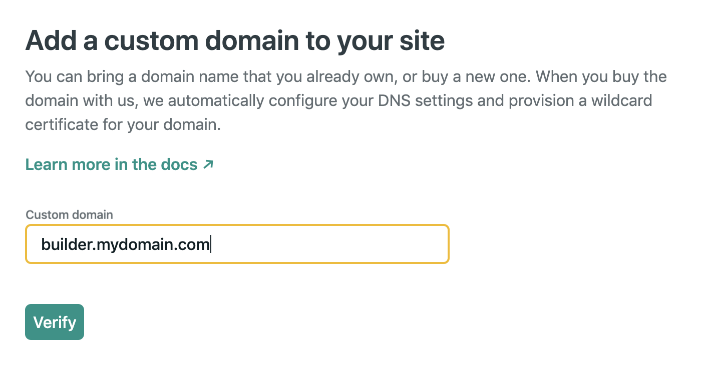
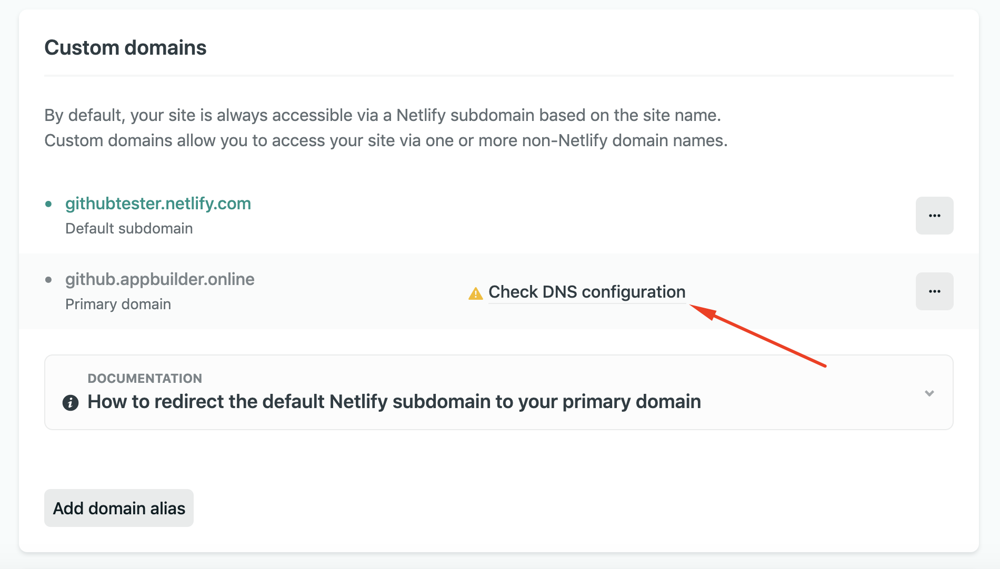
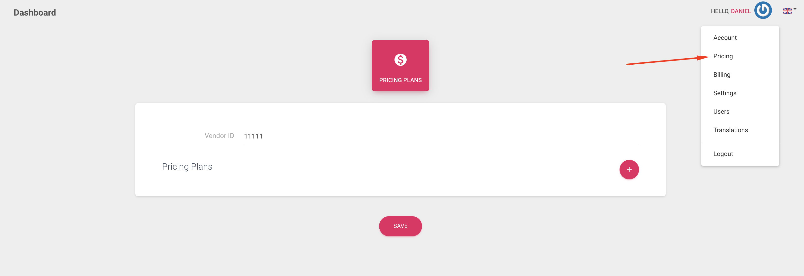

# Easy install on Netlify

## Video Guide 



> The video uses github - now we use gitlab. But steps are similar. Follow the written docs.

## Make Firebase and Paddle Account





## Become our collaborator on [GitLab](https://gitlab.com/)

By becoming our collaborator, you will always have access to the latest code. [Send us](https://help.mobidonia.com/#reactappbuilder) your [GitLab](https://gitlab.com/) username and purchase code. 

Then we will add you as collaborator on our repository.

[Fork it. ](https://docs.gitlab.com/ee/user/project/repository/forking_workflow.html#creating-a-fork)

Then you will have your own clone of the App Builder site. 


If you don't want to wait for us to give you access, you can [create new private repository with the code you downloaded](https://docs.gitlab.com/ee/gitlab-basics/create-project.html) from Code Canyon \(Builder Folder\). But this way you lose the opportunity to sync with our source code when we release new version. 


## Publish on Netlify

[Create account on Netlify.](https://www.netlify.com/)

Click on the button "New GIT Site" 

Then select GitLab and connect with your account where you have forked the repository. 

For **Build command** enter:   `CI=false && node fillenv.js && npm run build:cloud`

**Environment variables**


* [ ] REACT\_APP\_appName              - Your Project name
* [ ] REACT\_APP\_isSaaS                    - true
* [ ] REACT\_APP\_adminEmail           - Your desired admin email
* [ ] REACT\_APP\_purchaseCode      - Your CodeCanyon purchase code



* [ ] REACT\_APP\_apiKey                    - Firebase Api Key \( from console.firebase.com \)
* [ ] REACT\_APP\_appId                      - Firebase App ID \( from console.firebase.com
* [ ] REACT\_APP\_projectId                - Firebase Project ID \( from console.firebase.com \)



* [ ] REACT\_APP\_privateKey             - Private key \( from service account json \)
* [ ] REACT\_APP\_serviceAccount . - client\_email \( from service account json \)



Now on Netlify, click on "**Deploy new site**". 


In you project, register with the admin email you have provided. 

### 

### Configure React App Builder



Now you site is up and running. But it is running on a subdomain from Netlify. 

And you would want to have it under your domain. ex. builder.MYDOMAIN.com

NOTE: If you use Cloud Version - we will email you instructions. 

This is supper easy.  

1. **Go in Domain Settings**

2. **Add custom domain**

3. **Receive DNS info. Enter the required DNS changes in your cPanel, Domain Register or DNS provider.**




In your Paddle, go in **Developers Tools - &gt; Alerts/Week hooks**  
Paste the Url to receive web hooks   
  
****`https://YOUR_DOMAIN/.netlify/functions/paddle`  
****

You can also enter your email, to be notified.  
****Select all Subscription events to be notified for.



Set up pricing by clicking on your **Avatar -&gt; Pricing.** 





Your Builder Site is Active now. You can accept new customers now.


Now, let's see how you will make your client's apps. 

Learn more about our Cloud React App Builder \( We will make your client's apps \)



Or make your own app producer 

**Local \(** On your computer **\)**: Makes iPhone apps \( Mac Only \) and Android Apps \(MAC or Windows\) \)   



### Update to latest repository code.

WithGitlab, we can configure automatic code syn so your fork always has the latest code automatically. To do that.

[Send us ](https://help.mobidonia.com/#reactappbuilder)

1. GitLab Username
2. Forked project link
3. [Access token](https://gitlab.com/help/user/profile/personal_access_tokens.md#creating-a-personal-access-token) with **api** access

And your code and instance on Netlify will be always up to date. No manual action needed. 

