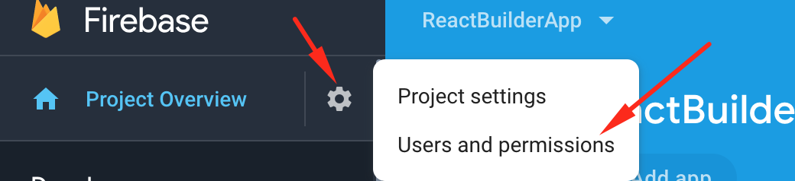
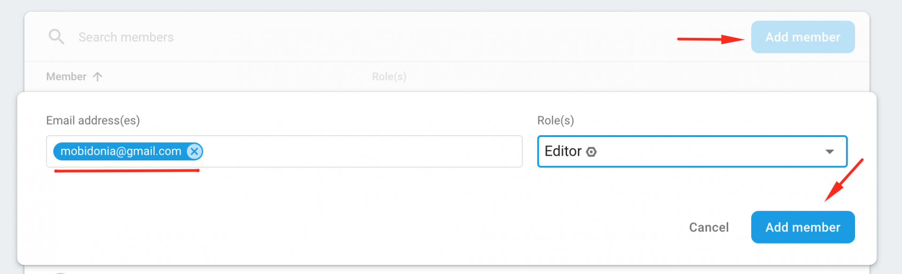

# How we can help you best.

Although documentation is strait forward, sometime you may encounter problems. 

In order to help you best with your problem we will need to following things from your side.

* [ ] CodeCanyon Purchase code. To validate your purchase
* [ ] Access to your firebase project
* [ ] Netlify Username and Password
* [ ] GitLab Username and Password
* [ ] URL to existing site
* [ ] SSH info if you need help on VPS

## How to add us as your Firebase Collaborators

To gain access to your database, you need to add us as collaborator. And here is how to do that.

1. In your Project, click on the cog icon. 

   Then click on **Users and permissions**

2. Now click on Add Member button and enter  
     **mobidonia@gmail.com** as editor  
     Then click on **Add Member**

Now we can see your database. 

After the problem is resolved, you can revoke the access by deleting our user from there. 

