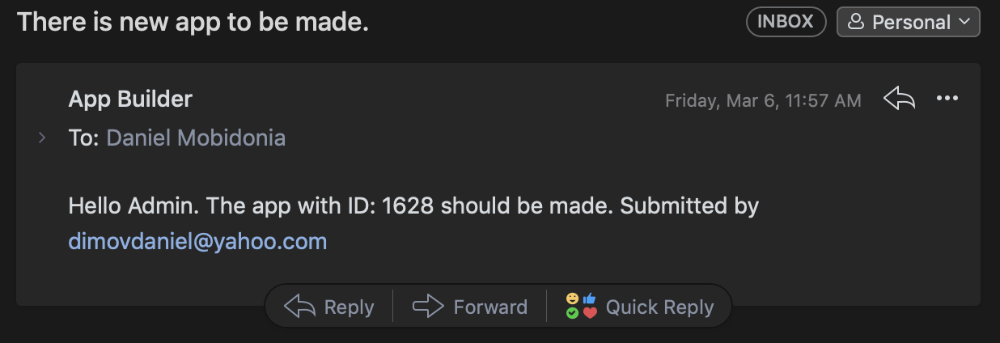
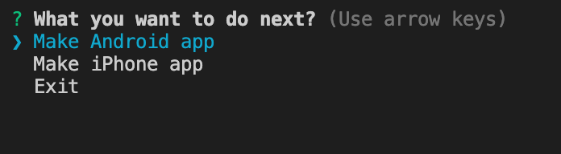

# Run App Producer locally

When there is new submitted from your clients or you, you as admin will get an email with the ID of the app to be made.

Open **Mobile App** folder in Visual studio

Open Visual Studio Code's terminal run **npm run produce**.

From the menu, select the "Make Android" or "Make iPhone App" \( Mac Only \).

Soon as you enter the ID, press enter, 

The process will fetch all the required items and put into place.

Expo.io will start to ask you questions. Read and answer them 

At the end, It will compile the JS Bundle, create the Android App/iOS app and download link will be displayed 

All your app builds can be found [here](https://expo.io/builds).

Advance guide on creating iOS Apps



