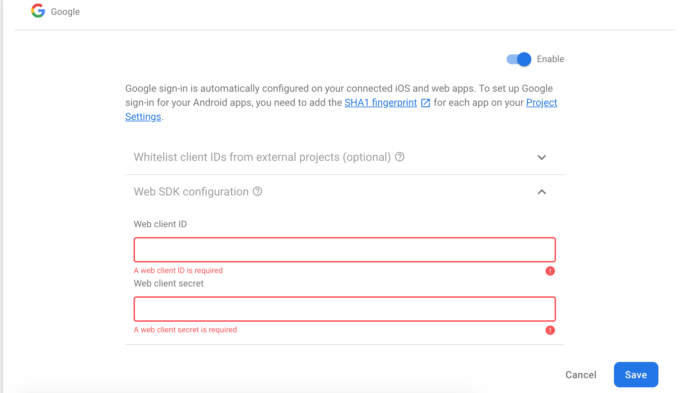
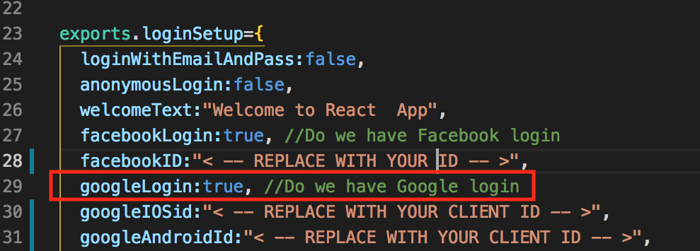
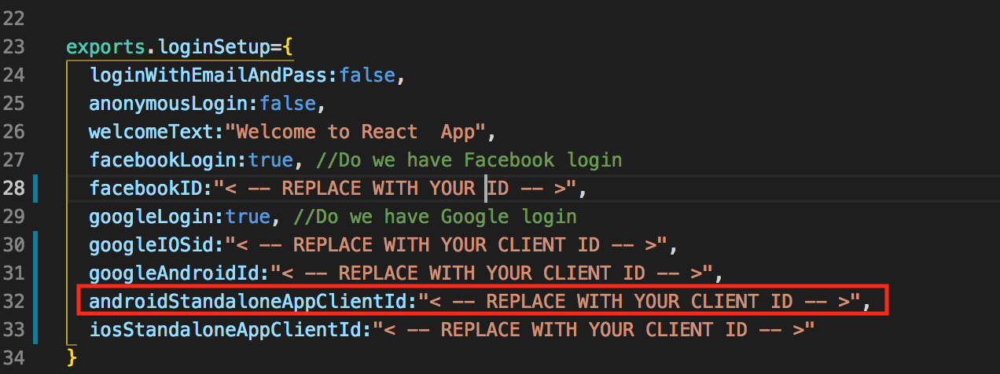

# App preview app

#### Requirements

This App Preview requires that you have purchased and installed React App Builder.

#### Install

Download the app preview app from your CodeCanyon Downloads.

Extract the zip file.

**Important**: Copy the [project\_config.json](https://mobidonia.support-hub.io/articles/project-confiigjson-1431) file from your [React App Build installation](https://mobidonia.support-hub.io/knowledgebase/129) to your App Preview.

Open the folder in VS Code.

The folder structure should look like this


Open a terminal and execute

```text
rab
```

You should see the menu now


#### Setup App Preview \( required \)

This option will do the following actions

* Install NPM modules
* Set up firebase\_config.js so your apps know how to connect to firebase
* Set up app.json

#### Run Preview App Locally

This option will start your app locally. It will open the browser, and you will have the option to run on a device or simulator. You can see your app, take screenshots and if you don't like some image you can change in assets/images and in App/images.


#### Deploy android app

When you are ok, how your preview app looks, you can execute the option to make an android .aab file. At the end of the process, you will receive a link to this .aab file. The file will be around 50MB, but when uploaded on Google Play will be resized to around 16MB.

Follow the onscreen instructions from expo.

Learn more about [publishing with expo](https://docs.expo.io/versions/v35.0.0/distribution/building-standalone-apps/).

#### Deploy iPhone app

When you are ok, how your preview app looks, you can execute the option to make an iPhone app.

Follow the onscreen instructions from expo.

This process will make the .IPA file for you. And you can do this from MAC, Windows and Linux.

But you will need a MAC computer to upload the .IPA file to Apple iTunes Connect.

There are some tools to upload ipa from windows, you can google search for that.

Or, there is a [MacinCloud](https://www.macincloud.com/) that you can rent.

Learn more about [publishing with expo](https://docs.expo.io/versions/v35.0.0/distribution/building-standalone-apps/).

#### Add a preview app

Execute this option when your app is live on google play or AppStore.

It will add information on your landing page and in your builder. So users can download the app and login with their user/pass to preview the apps.

### How to set up Google login

#### Enable Google Sign-In in the Firebase console

1. In the [Firebase console](https://console.firebase.google.com/?authuser=0), open the **Auth** section.
2. On the **Sign in method** tab, enable the **Google** sign-in method and click **Save**.


  3. Go to the [Google Developer Credentials](https://console.developers.google.com/apis/credentials).  
  4. Click **Create credentials**, then **OAuth client ID**, then select the **Web** radio button.  
  5. Copy **Client Id** and **Client secret** and add it to your **Web SDK configuration.** Look at the             picture below



#### Enable google login to your project

In the downloaded project you will find file config.js. In the object **loginSetup** you will find variable called **googleLogin**, ****set the value to **true.** Look at the picture below.



\*\*\*\*

#### Deploying to a standalone app on Android

All you have to do is to follow the Expo documentation for [google sign in](https://docs.expo.io/versions/latest/sdk/google/#deploying-to-a-standalone-app-on-android) and when you will finish with the steps for creating Android credentials, you will have the Client ID.

 

#### Add androidStandaloneAppClientId in the project

In the downloaded project you will find file config.js. In the object **loginSetup** you will find variable called **androidStandaloneAppClientId,** replace the value of this variable with the **Client ID** that you have created in the previous step.



#### Deploying to a standalone app on iOS

All you have to do is to follow the Expo documentation for [google sign in](https://docs.expo.io/versions/latest/sdk/google/#deploying-to-a-standalone-app-on-ios) and when you will finish with the steps for creating iOS credentials, you will have the Client ID.

#### Add iosStandaloneAppClientId in the project

In the downloaded project you will find file config.js. In the object **loginSetup** you will find variable called **iosStandaloneAppClientId,** replace the value of this variable with the **Client ID** that you have created in the previous step.


