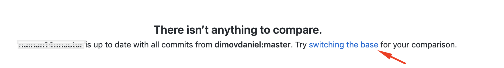

# Landing Page

Become our collaborator on Github

By becoming our collaborator, you will always have access to the latest code. [Send us](https://help.mobidonia.com/#reactappbuilder) your GitHub username and purchase code. 

Then we will add you as collaborator on our repository.

[Fork it. ](https://help.github.com/en/github/getting-started-with-github/fork-a-repo)

Then you will have your own clone of the App Builder Landing site. You can easily sync the changes from our source code.


If you don't want to wait for us to give you access, you can [create new private repository with the code](https://www.softwarelab.it/2018/10/12/adding-an-existing-project-to-github-using-the-command-line/) you downloaded from Code Canyon. But this way you lose the opportunity to sync with our source code when we release new version. 


## Publish on Netlify

[Create account on Netlify.](https://www.netlify.com/)

Click on the button "New GIT Site" 

Then select Github and connect with your account where you have forked the repository. 

For **Build command** enter \( default \): `npm run build`

**Environment variables**


Use the same Firebase project from previous setup for React App Builder!



* [ ] REACT\_APP\_apiKey                    - Firebase Api Key \( from console.firebase.com \)
* [ ] REACT\_APP\_appId                      - Firebase App ID \( from console.firebase.com
* [ ] REACT\_APP\_projectId                - Firebase Project ID \( from console.firebase.com \)


Now on Netlify, click on "**Deploy new site**". 

After that, you can point your domain there. 

### Update to latest repository code.

Just go in your forked repository, and click on the "Compare button".    
Then click on the link "switching the base".

Then if there are changes, you will see them. Then click on the  green button "Create Pull Request". Enter Title/Description if needed and once again click on "Create Pull Request".  
Then click on the other green button "Merge pull Request".

