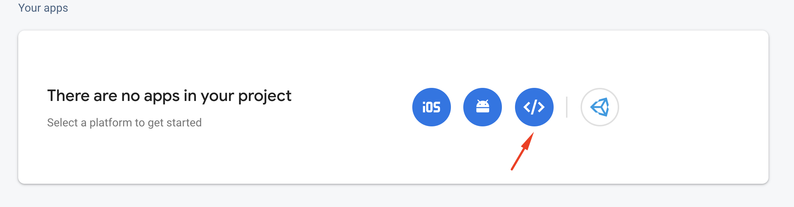

# Setup App Producer

### Step 1. Connect to your Firebase DB

Unzip the zip file that you got from CodeCanyon \( if you haven't already \). 

Open the file **Mobile App** with [Visual Studio Code](https://code.visualstudio.com).



To download service account JSON file go in  [console.firebase.com](https://console.firebase.google.com/) then in   
****Project -&gt; Project Settings - &gt; Service Accounts and click on "**Generate new private key**"

Extract the zip that you got from codecanyon.  
Save this file as **service-account-file.json** in **Mobile App/Producer/service-account-file.json**



Once again go in your [Firebase console](https://console.firebase.google.com/).  
Then go in Project Setting and create a web app.  
In the file structure, locate **firebase\_config.js**.   
Copy the values from Firebase to you **firebase\_config.js**. 






### Step 2. Install the node modules

In Visual Studio terminal run

```text
npm install
```


This may take a while. You may get some errors, but this doesn't necessary means that there are critical errors. Please continue withe the docs. If something is not working, send us screenshot of what you get during this install process.



