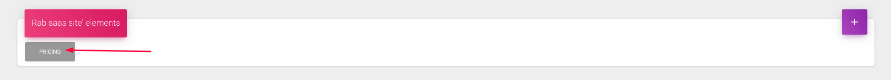

# Set pricing

### Initially setting pricing

In Visual Studio Code's terminal run **rabinstaller**.

From the menu, select the **"Set Pricing"**.

This action will upload/set your pricing plan that you will offer to your clients. 

For on-fly changes on the pricing, you can do them from the app builder page -&gt; settings. 

This is to just initially create your pricing plan. 

You as an admin will be able to make apps free.

### Managing pricing plans

With your admin email you will be able to manage before created initial pricing plans.

From the dropdown menu in Dashboard open **Settings** menu.

After that click on the Pricing option and you will see the screen with all information for the pricing plans.

Here you can add, change and delete pricing plans.

